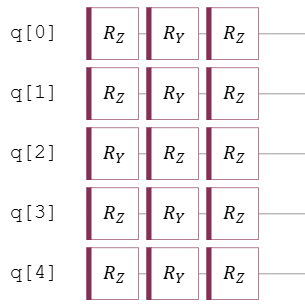
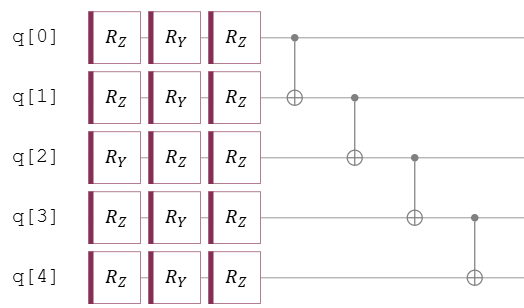
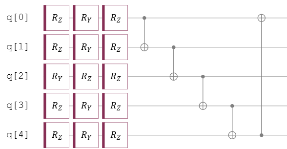
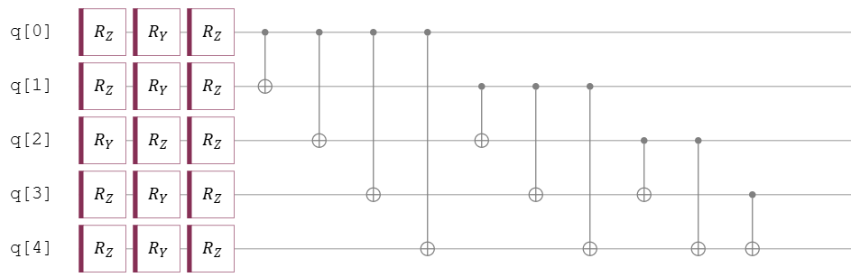
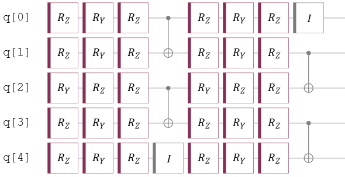
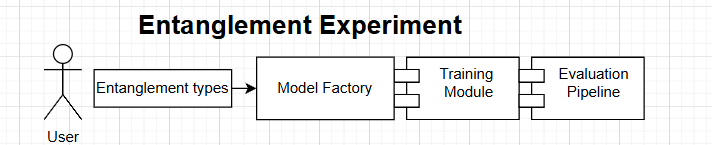
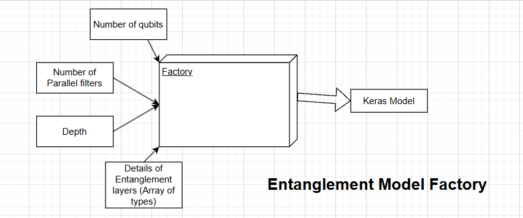
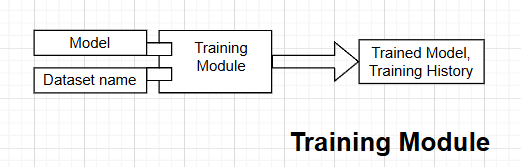
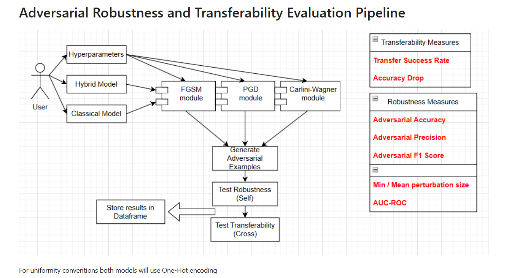
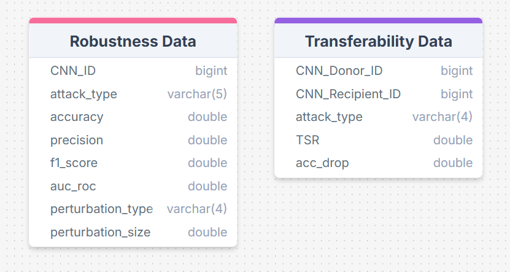

# AdversarialTransferabilityResearch

This project investigates the **adversarial transferability** of gradient-based attacks, specifically **Fast Gradient Sign Method (FGSM)**, **Projected Gradient Descent (PGD)**, and **Carlini-Wagner (CW)**, between Classical Convolutional Neural Networks (CNNs) and Hybrid Quantum-Classical CNNs (HQCNNs). This research focuses on the entanglement strategies used in HQCNNs.

 
## Project Overview

Adversarial examples, crafted on one type of model (classical or hybrid), are evaluated on the other to analyze their **cross-model vulnerability**. This bidirectional assessment aims to reveal the extent to which adversarial perturbations generated on one architecture can affect the other.

## Why is this important?

Understanding adversarial transferability is crucial for several reasons:

  * **Grey-Box and Black-Box Attacks:** In real-world scenarios, attackers often don't have full access to a model's architecture or parameters. Transferability allows adversaries to exploit shared weaknesses even with limited information. This is done by training adversarial examples on a surrogate model and using them to attack the target model.
  * **Robust AI Systems:** The findings from this study will inform the design of more robust and secure AI systems, particularly within the evolving landscape of quantum machine learning. It will deliver insight as to which entanglement strategies are more adversarially robust and less-prone to transfer attacks.

## Entanglement Strategies

Entanglement strategies are an important aspect of PQC design. 

### Homogenous Strategies:

These are Ansatz using only one type of entanglement layer throughout the circuit. The following are a few types:
  * No entanglement:
    In this strategy, the PQC consists only of parametric phase gates and no entangling layers. 

    


  * Linear Entanglement:
    In this strategy, we apply CNOT/CZ between neighboring qubits (N,N+1) pairs.

    

  * Circular Entanglement:
    This is an extension to the linear entanglement strategy where the last qubit is linked with the first to complete the ring.

        

  * Full Entanglement:
    In this strategy, there is a CNOT/CZ between every pair of qubits.
  
       

  * Staggered Entanglement:
    In this strategy, linking is done in layers or stages, typically by applying entangling gates to different non-overlapping, sets of qubits in sequential blocks of the circuit.

     

Note: in the above illustrations we have used CNOT but CZ can also produce an entangling effect.

## Methodology



The experiment shall generate lists describing entanglement layers in a defined model architecture.
This shall be passed to subsequent modules for model creation, model training and evaluation.

### Model Creation:



This module creates a HQCNN/Classical model based on parameters passed to it. For exact specifics refer to the files:

  * entanglement\_model\_factory.py
  * \_entanglement\_circuit.py
  * \_entanglement\_layer.py

:warning: **CAUTION** :warning: Throughout this experiment, the number of qubits used was kept at 5. If you wish to change it, please make this change in the helper module \_entanglement\_circuit.py, apart from entering the appropriate value in model\_creation\_factory.


### Model Training:



This module takes a model and a dataset and trains the model on that specific dataset. Training data is split 9:1 into training
and validation data. Model is trained using the Adam Optimizer. For exact specifics refer to the file:

  * training\_module.py

### Model Evaluation:



This pipeline takes two models and calculates adversarial robustness and transferability metrics for them and returns dataframes.

:warning: **CAUTION** :warning: By default Carlini-Wagner attacks are disabled in the pipeline as they are computationally 
expensive. If you wish to include them you can do so by setting carlini_wagner_flag = True before running the experiment.

The structure of the dataframes is given by:



For exact specifics refer to the file:

  * evaluation\_pipeline.py

### Final Output:
Running the experiment produces 3 useful csv files:
  * lib/index.csv:  contains model ID (hash) and architecture (entanglement strategy details)
  * lib/robustness.csv:  contains compiled robustness data
  * lib/transferability.csv: contains compiled transferability data

---

## Getting Started

### Prerequisites:

  * Python 3.12
  * pip >= 25.1.1

### Installation:

```bash
git clone https://github.com/ParthMunjalJoshi/AdversarialTransferabilityResearch.git
cd AdversarialTransferabilityResearch
pip install -r requirements.txt
```

### Usage:
```bash
python entanglement_experiment_homogenous.py
```

## Expected Outcomes
The project aims to provide insights into:
  * The degree of adversarial transferability between classical and hybrid quantum-classical CNNs.
  * The impact of different entanglement strategies on adversarial robusntess and transferability.


